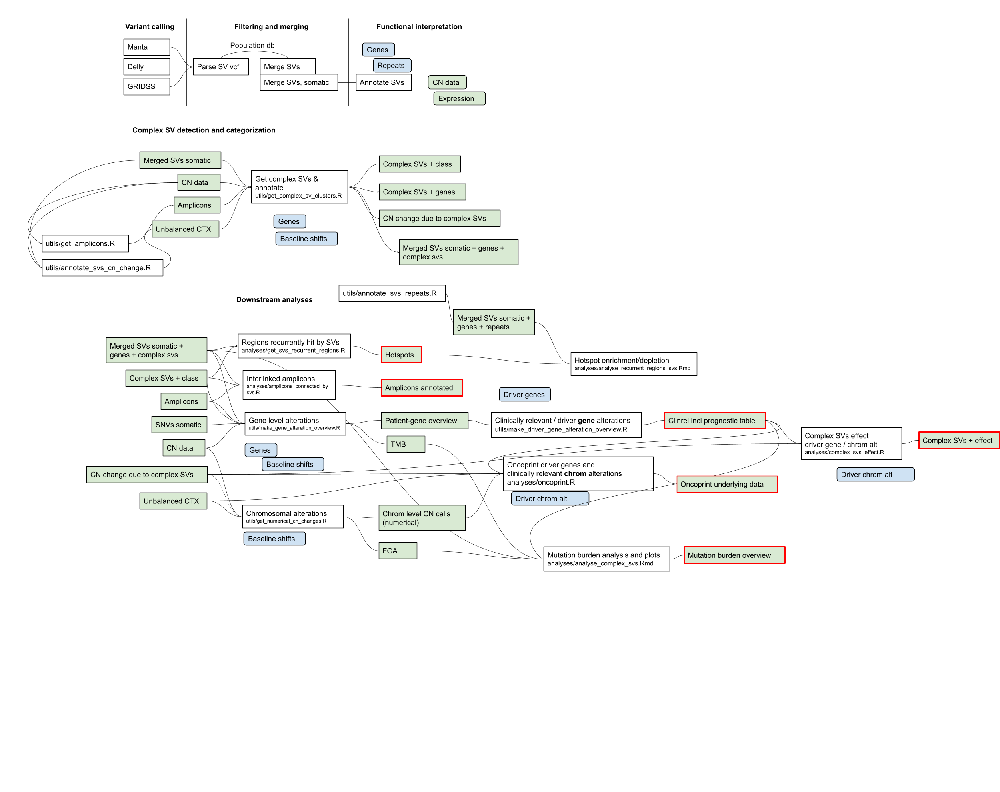

# Structural Variation

Toolkit used to generate results for ongoing structural variation projects in the Maxima.

This repo contains code to infer consensus somatic structural variants (SVs) from DELLY, Manta and GRIDSS, and also to annotate these variants. In addition, see `utils` and `analyses` for scripts supporting the results of our latest manuscripts.

## Subclasses of 1q gain in Wilms tumors (v1.0)

doi: 10.3390/cancers14194872

For example, unsupervised clustering based on copy number (CN) data and gene expression data, inferring chromosome status from CN data, as well as various integrative omics analyses.

* Unsupervised clustering CN data
    *   utils/make_cn_clusters.R
* Unsupervised clustering expression data
    *   utils/make_expression_clusters.R
* Integrate SNV/indel/CN/SVs/expression 
    *   utils/integrate_omics.R 

## Complex SV patterns in pediatric solid tumors (v2.0)

Complex SV detection and categorization into chromothripsis, chromoplexy and amplicon/ecDNA (extrachromosomal DNA) as well as analysis of whether they affect cancer driver genes or result in adverse chromosomal alterations associated with poor outcome. 

Supporting scripts:
* Amplicons
    *   utils/get_amplicons.R
* Integrate amplicons and SVs
    *   analyses/amplicons_connected_by_svs.R
* Unbalanced translocations
    *   utils/annotate_svs_cn_change.R
* Complex SV detection and categorization
also makes merged_svs_classes annotated with genes and complex SV classes
    *   utils/get_complex_sv_clusters.R
* Regions recurrently hit by SVs
    *   analyses/get_svs_recurrent_regions.R
* Merged SVs annotated with repeats 100 bp
    *   utils/annotate_svs_repeats.R
* Hotspot plotting and analysis
    *   analyses/analyse_recurrent_regions_svs.Rmd
* Patient-gene level overview of alterations, integration of SNVs/indels/SVs
    *   utils/make_gene_alteration_overview.R
* Driver gene alterations
    *   utils/make_driver_gene_alteration_overview.R
* Complex SVs effect, annotate with driver gene / chrom alterations
    *   analyses/complex_svs_effect.R
* Oncoprint with driver genes and adverse chrom alterations
    *   analyses/oncoprint.R
* Chrom level CN calls (numerical) - FGA, aneuploidy
    *   utils/get_numerical_cn_changes.R
* Mutation burden analysis and plots
    *   analyses/analyse_complex_svs.Rmd

Gene lists:
* Pediatric cancer gene panel
    *   resources/diagnostic_somatic_2.5.lst
* Cancer driver genes per cancer type
    *   resources/map_clinrel_mutations.txt
* Unfavorable chromosomal alterations per cancer type
    *   resources/map_clinrel_chromalt.txt

## Usage 

Consensus somatic structural variants (SVs) from DELLY, Manta and GRIDSS. 

`singularity exec --bind /path/to/input/ ~/structural_variation_latest.sif R -e "source('~/default.conf');source('~/default.docker.conf');source('~/patient.conf');source('~/cohort.conf');source('~/parse_sv_vcf.R')"`

Image: https://hub.docker.com/r/ivanbelzen/structural_variation

Order for running scripts:

* parse_sv_vcf.R
* pairwise_overlaps.population_db.R
* merge_svs.R [optional]
* merge_svs.somatic.R

## Software requirements

* Manta version 1.6
    *   Chen X, Schulz-Trieglaff O, Shaw R, Barnes B, Schlesinger F, Källberg M, Cox AJ, Kruglyak S, Saunders CT (2016) Manta: rapid detection of structural variants and indels for germline and cancer sequencing applications. Bioinformatics 32:1220–1222
* DELLY version 0.8.1
    *   Rausch T, Zichner T, Schlattl A, Stutz AM, Benes V, Korbel JO (2012) DELLY: structural variant discovery by integrated paired-end and split-read analysis. Bioinformatics 28:i333–i339
* GRIDSS version 2.7.2
    *   Cameron DL, Schröder J, Penington JS, Do H, Molania R, Dobrovic A, Speed TP, Papenfuss AT (2017) GRIDSS: sensitive and specific genomic rearrangement detection using positional de Bruijn graph assembly. Genome Research 27:2050–2060
	
	
The SV toolkit needs the following configuration to run

* R version 4.0
* Bioconductor version 3.12

Packages:

* GenomicRanges
* VariantAnnotation
* StructuralVariantAnnotation
* rtracklayer
* ensembldb
* tidyverse
* dplyr
* stringr
* stringdist

For unsupervised clustering based on copy number data and expression data:
* CNpare version (version 0.99)
    *   Chaves-Urbano, B., Hernando, B., Garcia, M.J., and Macintyre, G. (2022). CNpare: matching DNA copy number profiles. Bioinformatics.

* NMF version (version 0.23)
    *   Brunet, J.P., Tamayo, P., Golub, T.R., and Mesirov, J.P. (2004). Metagenes and molecular pattern discovery using matrix factorization. Proc. Natl. Acad. Sci. U. S. A. 101.

## External resources  

SVs in the general population:

* NCBI Curated Common Structural Variants (nstd186)
    *   dbVar. https://www.ncbi.nlm.nih.gov/dbvar/studies/nstd186/. 
* gnomAD Structural Variants (nstd166)
    *   Collins RL, Brand H, Karczewski KJ, et al (2020) A structural variation reference for medical and population genetics. Nature. https://doi.org/10.1038/s41586-020-2287-8
* DGV (version 2020-02-25) 
     *   MacDonald JR, Ziman R, Yuen RKC, Feuk L, Scherer SW (2014) The Database of Genomic Variants: a curated collection of structural variation in the human genome. Nucleic Acids Res 42:D986–92

Genome annotation retrieved from the UCSC table browser: 

* Repeats from RepeatMasker (LINE, SINE, LTR) 
* Segmental duplications
* Chromosome bands
    *   Navarro Gonzalez J, Zweig AS, Speir ML, et al (2020) The UCSC Genome Browser database: 2021 update. Nucleic Acids Res 49:D1046–D1057

Gene annotation:

* Gencode annotation version 38
    *   https://www.gencodegenes.org/human/release_38.html

Cancer gene datasets:

* COSMIC (cancer gene census v92)
    *   Tate JG, Bamford S, Jubb HC, et al (2019) COSMIC: the Catalogue Of Somatic Mutations In Cancer. Nucleic Acids Res 47:D941–D947
* OncoKB (accessed on 2021-04-14) 
    *   Chakravarty D, Gao J, Phillips SM, et al (2017) OncoKB: A Precision Oncology Knowledge Base. JCO Precis Oncol. https://doi.org/10.1200/PO.17.00011
* Gröbner et al., recurrently mutated genes in pediatric cancer.
    *   Gröbner SN, Worst BC, Weischenfeldt J, et al (2018) The landscape of genomic alterations across childhood cancers. Nature 555:321–327
* Treger et al.: recurrently mutated genes in Wilms tumors. 
    *   Treger, T.D., Chowdhury, T., Pritchard-Jones, K., and Behjati, S. (2019). The genetic changes of Wilms tumour. Nat. Rev. Nephrol. 15, 240–251.

Additional annotation

* CTAT resource genome lib version GRCh38_gencode_v31_CTAT_lib_Oct012019
    *   https://data.broadinstitute.org/Trinity/CTAT_RESOURCE_LIB/__genome_libs_StarFv1.8/
* Human transcription factors v1.01
    *   Lambert SA, Jolma A, Campitelli LF, Das PK, Yin Y, Albu M, Chen X, Taipale J, Hughes TR, Weirauch MT (2018) The Human Transcription Factors. Cell 172:650–665
* Human protein kinases
    *   Manning G, Whyte DB, Martinez R, Hunter T, Sudarsanam S (2002) The protein kinase complement of the human genome. Science 298:1912–1934

